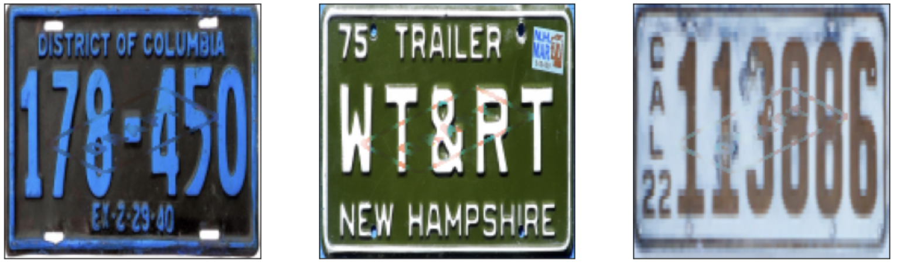

# Image Visible Masking/Watermark Removal with GNNs

You can use this [Colab](https://colab.research.google.com/drive/1WeMF0gEdSPrYvNwOBdFufBO_vOZvWaLJ?usp=sharing) 
and follow our [Medium post](https://medium.com/@sluo3/8fbb9747df08) to run the training.

Specifically, you could run label_propagation.ipynb for the label propagation result described in the Medium post and you could 
run gnn_cs.ipynb for the results of the Graph Neural Networks with Correct & Smooth (GNN-C&S). We have included two GNN models: GCN and GAT in our training.

Watermarked images:

GAT+C&S to remove watermarks:

